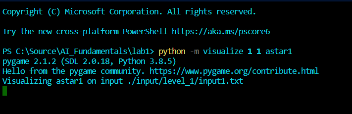

# About visualize.py

## To visualize step by step

### Step 1

Change direction into folder includes your visualize.py.

### Step 2

Type down in your terminal:

```sh
> python visualize <level> <input_file> <algorithm>
```

With these arguments values following optionally the table below:

| `<level>`         | `<input_file>`    | `<algorithm>`                                                   |
| ----------------- | ----------------- | --------------------------------------------------------------- |
| `1` `2` `advance` | `1` `2` `3` `...` | `bfs` `dfs` `ucs` `gbfs1` `gbfs2` `astar1` `astar2` `adv` `...` |

Eg. if we want run a visualization of `astar algorithm` with `heuristic-function-1` on `input1.txt` of `level_1` we use this command line:

```sh
> python -m visualize 1 1 astar1
```



_~~Enjoin~~ the visualization_ :)

### One more thing

When the visualization done, you will see an output visualize image file in folder `./visualize_img/` . The image is the last fame captured of the visualize process. Something like this:


